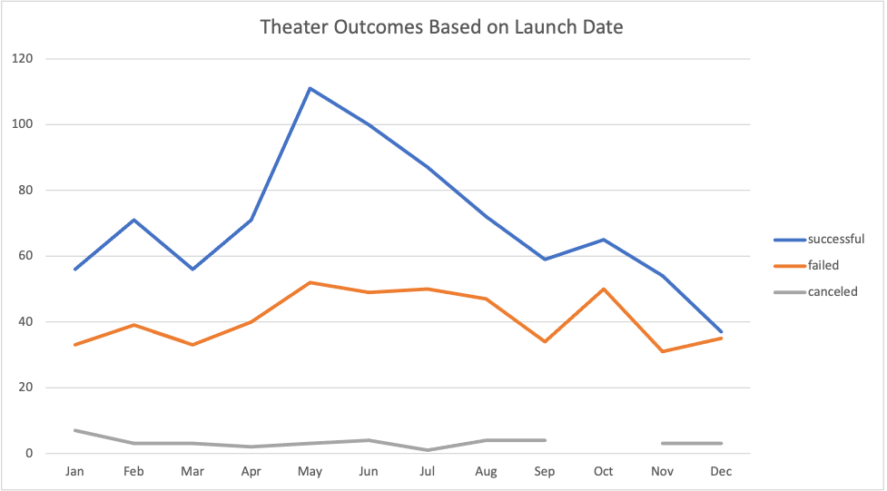
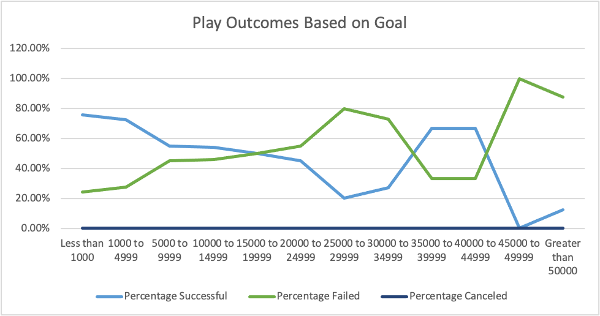

# An Analysis of Kickstarter Campaigns
---
## Overview of Project
This project was created to help Louise launch a successful kickstarter campaign in order to fund her play, *Fever*. To ensure that Louise had well-informed expectations, this analysis worked with a set of data from over 4,000 unique kickstarter campaigns. These campaigns were focused on a variety of different categories, but a signficant number were also focused on theater and plays. The most crucial data for the purpose of this analysis was whether the outcome of each campaign was successful, failed, or canceled.

### Purpose
Since Louise's campaign came close to its fundraising goal, this analysis sought to demonstrate how successful other campaigns were based on when they were launched, and how high each campaign's goal was. In order to determine the relationship between these sets of criteria, I used data from the "outcomes" column and the "goals" column. I also used data from the "launched_at" column to determine if there was a relationship between when a campaign was launched and whether that campaign was successful. By dividing the campaigns based on their outcomes, I was able to compare successful campaigns to failed and canceled campaigns to observe whether the goal and launch date had any impact on their outcomes.

## Analysis and Challenges

### Analysis of Outcomes Based on Launch Date
To determine the relationship between outcomes and their launch dates, I only needed to pull data from when each campaign was launched and the outcome of each campaign. To view this in a more visually accessible way, I put this data in a pivot chart so that the columns displayed different outcomes and the rows separated these outcomes based on the month each campaign was launched. Since Louise was specifically focused on funding her play, I also used the filter option to limit the data to only theater campaigns. This pivot table also included a "Grand Total" column which calculated the sum of successful, failed and canceled theater campaigns per month. A line chart with the number of successful, failed, and canceled theater campaigns per month can be seen below: 

### Analysis of Outcomes Based on Goals
Since meeting the goal is the only way that a kickstarter campaign is deemed 'successful', we should also try to determine whether there is a correlation between goal amounts and  rates of success/failure. For example, one might think that it's easier to successfully fund a $100 campaign than it would be to successfully fund a $10,000 campaign. To see how much of an impact the goal had on the rates of success, I once again used data from the "outcomes" column, but filtered this data based on different amounts in the "goals" column of the spreadsheet. The number of successful, failed, and canceled outcomes was separated by 12 goal ranges of about $5000. These ranges started from campaign goals set under $1000 and ended with campaign goals set over $50,000. Since Louise is most interested in how this data compares to her project, I also filtered these numbers to only show data from other plays. These figures show that there was a much higher number of successful campaigns with lower goals than there were with higher goals. However, based on just the number, we can see that this is also true for failed campaigns. Since the $1000-$4999 range had almost 3 times as many projects as any other range, a more useful indicator of success rate would be to take the percentage of successful and failed campaigns for each given range. Therefore, I used the number of successful campaigns divided by the total number of projects for each range to calculate the success rate. I did the same for failed and canceled campaigns, but there were zero canceled play kickstarter campaigns to use in this comparison. A line chart demonstrating the correlation between outcomes and goals can be seen below:  

### Challenges and Difficulties Encountered
While I did not have many challenges in compiling and organizing this data, there are certain obstacles to overcome so that I could organize the data the way I wanted to. First, when finding a relation between outcomes and launch date, the launch date is not exactly accessible. The kickstarter worksheet only lists these dates in unix timestamps, which does not immediately show what month and year campaigns were launched in. Therefore, I had to use a formula to convert these unix timestamps into human calendar dates. Once these dates were converted, it was simple to build a pivot table and filter these campaigns by the month they were launched. My biggest difficulty in organizing this data was when I was calculating the number of successful and failed campaigns for a given range. It was simple enough to use the filters for a countifs function for anything less than $1000, but it became more difficult when it had to be both greater than a given amount and less than another amount. I eventually realized that it needed an additional criteria range, but I second-guessed myself when excel displayed a message that this formula was inconsistent with the above. When I continued editing the range for other rows, this message went away. I imagine that this 'inconsistent' message only appeared because it differed from the range above when I copied the formula to the rest of the column. 

## Results

- What are two conclusions you can draw about the Outcomes based on Launch Date?
  - First, I can conclude that there are a higher number of successful theater campaigns that were launched during May, June, and July than there were compared to the rest of the months. 
  - I can also conclude that while there is a higher number of total successful theater campaigns than failed theater campaigns, the ratio of successful campaigns to failed campaigns in the month of December is roughly equal.

- What can you conclude about the Outcomes based on Goals?
  - I can conclude that you are more likely to have a successful play kickstarter campaign if you set a lower goal. Following this same logic, you are also less likely to fail if you set a lower goal. Based on this data, you are more likely to fail than succeed once a play's campaign goal is set to greater than or equal to $20,000. 

- What are some limitations of this dataset?
  1. Theater Outcomes based on Launch Date appears to show summer months as most successful, but that's also because there were more total projects created in these months. Since the graph for this data only shows the total number of successful outcomes, it would not account for whether more kickstarter projects get created during a certain time of year. 
  2. The Outcomes Based on Goal chart shows that certain higher ranges favor successful campaigns by a 2:1 margin. However, there is such a low number of total projects for any goal above $25,000 that we cannot generalize the data for those higher ranges. We cannot conclude that you're more likely to have a successful play campaign if the goal is set between $40,000-$44,999 solely because 2 out of those 3 projects were successful. There were clearly other factors involved in this small data set, and there weren't enough total projects set at this amount to assume that this data is representative of the population. Not all points on this line graph can be treated equally when one point has a sample size over 500 and other points have sample sizes of 5, 6, 3, and 1. 

- What are some other possible tables and/or graphs that we could create?
  - To account for limitation 1, we can create a line chart that calculates the percentage of successful campaigns rather than the aggregate number. In order to do this, we would have to create an extra column from our pivot table that divides the number of successful campaigns by the 'grand total' to create a percentage. 
  - To account for limitation 2, it might be more useful to create a line chart with lower and narrower ranges. Rather than setting the upper limit at >$50,000, we could set it at $20,000 and re-write these rows with ranges of about $2,500 each. 
